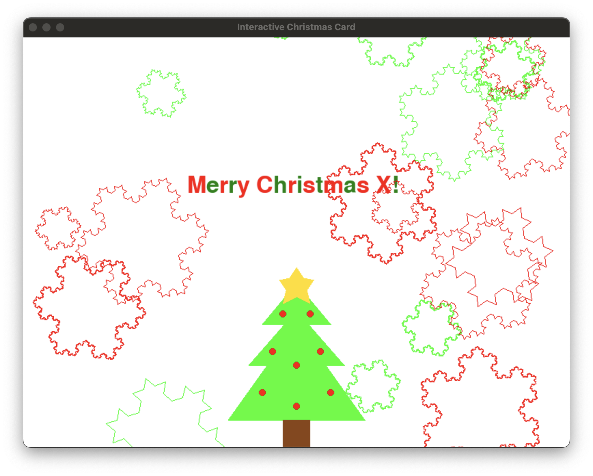

Tutorial: Create your own interactive Christmas card in Python using Pygame!



---

### Step 1: Set Up Your Environment
Before we begin, make sure you have Python and Pygame installed. If not, you can install Pygame by running:
```bash
pip install pygame
```

---

### Step 2: Create the Base of the Card
The first thing we need is a **Pygame window** where everything will be drawn. This includes:
1. **Initializing Pygame** with `pygame.init()`.
2. Setting up the **screen dimensions** and display title.

Here’s the code for that:
```python
import pygame
import random
import math

# Initialize Pygame
pygame.init()

# Screen dimensions
WIDTH, HEIGHT = 800, 600
screen = pygame.display.set_mode((WIDTH, HEIGHT))
pygame.display.set_caption("Interactive Christmas Card")

# Colors
RED = (255, 0, 0)
GREEN = (0, 255, 0)
BROWN = (139, 69, 19)
WHITE = (255, 255, 255)
DARK_GREEN = (0, 128, 0)

# Clock for controlling the frame rate
clock = pygame.time.Clock()
```

This gives us a blank canvas to work on, and sets up color variables we'll use later!

---

### Step 3: Add the Falling Snowflakes
We’ll make a `Snowflake` class that:
1. **Randomizes** the position, size, speed, and rotation of each snowflake.
2. Allows snowflakes to **fall down the screen** and reset when they go off-screen.
3. Uses a **recursive Koch Snowflake algorithm** for the snowflake shape.

Before we dive into the code, let me give you some context on the Koch Algorithm:

The **Koch snowflake** is a fractal, a geometric figure that exhibits self-similarity, meaning it looks similar at any level of magnification. It was first introduced by **Helge von Koch** in 1904 as a way to illustrate a mathematical curve that is continuous everywhere but differentiable nowhere.

#### **Construction Process**
The Koch snowflake is constructed iteratively from an equilateral triangle. Here's how it works:

1. **Start with an Equilateral Triangle**:
   - Begin with a triangle with equal sides.

2. **Divide Each Side into Three Equal Parts**:
   - For each side of the triangle, divide it into three equal segments.

3. **Add a "Bump" to the Middle Segment**:
   - Replace the middle segment with two sides of a smaller equilateral triangle pointing outward. This creates a "bump."

4. **Repeat the Process**:
   - Apply this process recursively to every line segment created in the previous iteration. Each iteration adds more detail and increases the total length of the curve.

#### **Key Mathematical Properties**
1. **Perimeter**:
   - At each iteration, the perimeter of the snowflake increases because new segments are added.
   - Mathematically, if the initial side length of the triangle is \( L \), then:
     \[
     P_n = L \cdot 3 \cdot \left(\frac{4}{3}\right)^n
     \]
     where \( n \) is the number of iterations.

   - As \( n \to \infty \), the perimeter tends to infinity, making it a curve of infinite length.

2. **Area**:
   - The area converges to a finite value. Even though the perimeter grows indefinitely, the total area inside the snowflake remains bounded.

3. **Fractal Dimension**:
   - The Koch snowflake has a fractal dimension:
     \[
     D = \frac{\log(4)}{\log(3)} \approx 1.2619
     \]
   - This means it is more than a one-dimensional line but less than a two-dimensional surface.

4. **Continuity**:
   - The curve is continuous everywhere but differentiable nowhere. This means you can draw it without lifting your pen, but it has no well-defined slope at any point.

---

#### **Origins**
The Koch snowflake was introduced by Swedish mathematician **Helge von Koch** in his 1904 paper, *"On a Continuous Curve Without Tangents, Constructible from Elementary Geometry."* It was one of the first examples of a mathematical object that challenged the traditional notions of geometry and calculus.

#### **Significance in Mathematics**
1. **Counterexample in Calculus**:
   - The Koch curve was created to show that a curve can be continuous everywhere but nowhere differentiable, a concept that was difficult to grasp in the 19th century when most curves were expected to behave "smoothly."

2. **Development of Fractal Geometry**:
   - The Koch snowflake is a precursor to modern fractal geometry, which was formalized by **Benoît Mandelbrot** in the 20th century.
   - Fractals like the Koch snowflake are now used to describe complex shapes in nature, such as coastlines, mountain ranges, and clouds.

#### **Applications in Modern Times**
1. **Computer Graphics**:
   - The Koch algorithm is used in computer graphics to create realistic snowflakes, landscapes, and textures.

2. **Nature Modeling**:
   - Fractal geometry inspired by the Koch snowflake helps model irregular structures in nature.

3. **Antenna Design**:
   - Fractal shapes like the Koch curve are used in designing compact and efficient antennas with broad bandwidth.

---

### **Why Is It Fascinating?**
The Koch snowflake is fascinating because it defies our intuition:
- A finite area is enclosed by an infinite perimeter.
- It is a simple yet profound example of self-similarity.
- It represents how complexity arises from simple rules.

---

By implementing this algorithm in your code, you simulate the recursive process of generating one of the most famous fractals in mathematics, a testament to both its beauty and complexity!

Here's the code:
```python
def koch_snowflake(order, scale=100):
    def divide_segment(p1, p2):
        dx, dy = p2[0] - p1[0], p2[1] - p1[1]
        p3 = (p1[0] + dx / 3, p1[1] + dy / 3)
        p4 = (p1[0] + dx * 2 / 3, p1[1] + dy / 3 * 2)
        px, py = (
            p3[0] + dx / 3 * math.cos(math.pi / 3) - dy / 3 * math.sin(math.pi / 3),
            p3[1] + dx / 3 * math.sin(math.pi / 3) + dy / 3 * math.cos(math.pi / 3),
        )
        p5 = (px, py)
        return [p1, p3, p5, p4, p2]

    def recurse(points, level):
        if level == 0:
            return points
        new_points = []
        for i in range(len(points) - 1):
            new_points.extend(divide_segment(points[i], points[i + 1])[:-1])
        new_points.append(points[-1])
        return recurse(new_points, level - 1)

    points = [
        (0, -scale),
        (-scale * math.sin(math.pi / 3), scale / 2),
        (scale * math.sin(math.pi / 3), scale / 2),
        (0, -scale),
    ]
    return recurse(points, order)
```

Now, define your snowflake class and its parameters, implementing the Koch algorithm:

```python
class Snowflake:
    def __init__(self, x, y, color, order):
        self.x = x
        self.y = y
        self.color = color
        self.order = order
        self.scale = random.randint(10, 40)
        self.points = koch_snowflake(order, scale=self.scale)
        self.speed = random.uniform(1, 3)
        self.angle = random.uniform(0, 360)
        self.rotation_speed = random.uniform(-2, 2)

    def draw(self, surface):
        rotated_points = []
        for p in self.points:
            px = p[0] * math.cos(math.radians(self.angle)) - p[1] * math.sin(math.radians(self.angle))
            py = p[0] * math.sin(math.radians(self.angle)) + p[1] * math.cos(math.radians(self.angle))
            rotated_points.append((self.x + px, self.y + py))
        pygame.draw.lines(surface, self.color, False, rotated_points, 1)

    def update(self):
        self.y += self.speed
        self.angle += self.rotation_speed
        if self.y > HEIGHT:
            self.y = -100
            self.x = random.randint(0, WIDTH)
            self.scale = random.randint(30, 100)
            self.points = koch_snowflake(self.order, scale=self.scale)
            self.speed = random.uniform(1, 3)
            self.rotation_speed = random.uniform(-2, 2)
```

Each snowflake is unique and rotates as it falls!

---

### Step 4: Add a Festive Christmas Tree
A Christmas card isn’t complete without a tree. We’ll create a **tree with three green triangles (for the foliage)** and a **brown rectangle (for the trunk)**. You can also add **red ornaments** and a **yellow star**.

Here’s the `draw_christmas_tree` function:
```python
def draw_christmas_tree(surface):
    # Tree foliage
    tree_top = [(WIDTH // 2, HEIGHT - 240), (WIDTH // 2 - 50, HEIGHT - 180), (WIDTH // 2 + 50, HEIGHT - 180)]
    tree_middle = [(WIDTH // 2, HEIGHT - 200), (WIDTH // 2 - 70, HEIGHT - 120), (WIDTH // 2 + 70, HEIGHT - 120)]
    tree_bottom = [(WIDTH // 2, HEIGHT - 180), (WIDTH // 2 - 100, HEIGHT - 40), (WIDTH // 2 + 100, HEIGHT - 40)]
    
    pygame.draw.polygon(surface, DARK_GREEN, tree_top)
    pygame.draw.polygon(surface, DARK_GREEN, tree_middle)
    pygame.draw.polygon(surface, DARK_GREEN, tree_bottom)

    # Tree trunk
    trunk_rect = pygame.Rect(WIDTH // 2 - 20, HEIGHT - 40, 40, 40)
    pygame.draw.rect(surface, BROWN, trunk_rect)

    # Star
    star_points = [
        (WIDTH // 2, HEIGHT - 263),
        (WIDTH // 2 - 10, HEIGHT - 248),
        (WIDTH // 2 - 25, HEIGHT - 245),
        (WIDTH // 2 - 15, HEIGHT - 230),
        (WIDTH // 2 - 20, HEIGHT - 210),
        (WIDTH // 2, HEIGHT - 220),
        (WIDTH // 2 + 20, HEIGHT - 210),
        (WIDTH // 2 + 15, HEIGHT - 230),
        (WIDTH // 2 + 25, HEIGHT - 245),
        (WIDTH // 2 + 10, HEIGHT - 248)
    ]
    pygame.draw.polygon(surface, (255, 223, 0), star_points)

    # Ornaments
    ornaments = [
        (WIDTH // 2 - 20, HEIGHT - 195),
        (WIDTH // 2 + 20, HEIGHT - 195),
        (WIDTH // 2 - 35, HEIGHT - 140),
        (WIDTH // 2 + 35, HEIGHT - 140),
        (WIDTH // 2 - 50, HEIGHT - 80),
        (WIDTH // 2 + 50, HEIGHT - 80),
        (WIDTH // 2, HEIGHT - 120),
        (WIDTH // 2, HEIGHT - 60)
    ]
    for ornament in ornaments:
        pygame.draw.circle(surface, RED, ornament, 5)
```

---

### Step 5: Add Festive Text
Add a friendly "Merry Christmas!" message in alternating red and green letters:
```python
def draw_christmas_text(surface, text, x, y):
    font = pygame.font.Font(None, 50)
    colors = [RED, DARK_GREEN]
    for i, letter in enumerate(text):
        color = colors[i % 2]
        letter_surface = font.render(letter, True, color)
        surface.blit(letter_surface, (x, y))
        x += letter_surface.get_width()
```

---

### Step 6: Put It All Together
Use the main game loop to:
1. **Clear the screen**.
2. **Draw the snowflakes**.
3. **Draw the tree**.
4. **Display the text**.

```python
# Create a list of snowflakes
snowflakes = [
    Snowflake(
        random.randint(0, WIDTH),
        random.randint(-HEIGHT, 0),
        random.choice([RED, GREEN]),
        random.randint(2, 5),
    )
    for _ in range(20)
]

# Main game loop
running = True
while running:
    screen.fill(WHITE)

    for event in pygame.event.get():
        if event.type == pygame.QUIT:
            running = False

    # Draw the Christmas tree
    draw_christmas_tree(screen)

    # Draw the "Merry Christmas X" text
    draw_christmas_text(screen, "Merry Christmas [Custom Name]!", WIDTH // 2-160, 200)  # Adjust x, y for position

    # Update and draw each snowflake
    for snowflake in snowflakes:
        snowflake.update()
        snowflake.draw(screen)

    pygame.display.flip()
    clock.tick(60)

pygame.quit()
```

---

### Step 7: Run and Enjoy!
When you run the code, you’ll see:
- Snowflakes falling and rotating.
- A decorated Christmas tree.
- A cheerful message in alternating colors.

Feel free to customize the colors, shapes, and animations to make it your own interactive Christmas card! 🎄✨